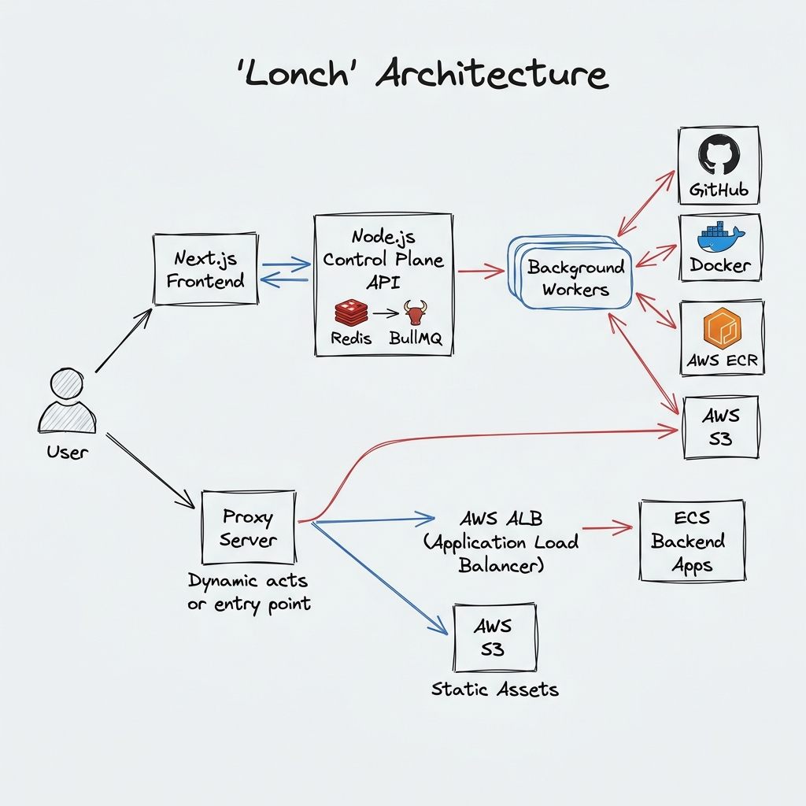

# Lonch Platform (Backend & Control Plane)

The official backend and deployment control plane for Lonch, a high-performance Platform as a Service (PaaS) designed for seamless application hosting. This repository manages dynamic infrastructure provisioning, zero-config deployment pipelines, and intelligent traffic routing to AWS services.

<video src="https://github.com/user-attachments/assets/2524e9d9-6e67-40c1-bbde-65247f47166c" width="100%" autoplay loop muted playsinline></video>


## Links

- **Live Platform**: https://lonch.cloud/
- **Frontend Repository**: https://github.com/iCoderabhishek/client-lonch
- **Backend Repository**: https://github.com/iCoderabhishek/Lonch
- **Postman API Docs**: https://www.postman.com/iamabhishek-1310-s-team/workspace/lonch

## Why Lonch?

While massive platforms like Vercel or Render exist, Lonch is purpose-built to address the complexities of provisioning isolated AWS resources (ECS, ALB, ECR, S3) dynamically from a centralized control plane. It serves as a comprehensive demonstration of how to build a scalable, multi-tenant PaaS, complete with automated Docker builds, background workers, zero-downtime deployments, and real-time Server-Sent Events (SSE) log streaming.

## Architecture & Data Flow

Lonch is designed around a decoupled micro-architecture pattern that separates the main REST API from computationally heavy deployment tasks and dynamic proxy routing.



1. **Authentication & API**: The user authenticates via the Express API (using Github OAuth). Access to deployments, projects, and domains is securely controlled and persisted in PostgreSQL using Prisma.
2. **Deployment Pipeline (BullMQ + Redis)**: 
   - Instead of blocking the main thread, when a user triggers a deployment, the API pushes a job to a Redis queue.
   - Background workers (static or backend) pick up the job, securely clone the GitHub repository, and automatically infer the correct language, framework, and build commands (Zero-config deployment).
3. **Infrastructure Provisioning**:
   - **Static Sites**: The worker builds the site using a temporary Docker container and uploads the compiled assets directly to AWS S3.
   - **Backend Apps**: The worker builds a Docker image, pushes it to AWS ECR, provisions an ALB Target Group, and registers a new AWS ECS Fargate task definition.
4. **Dynamic Proxy Routing**:
   - All incoming traffic to `*.lonch.cloud` hits the custom Lonch Node.js proxy middleware.
   - The proxy dynamically queries the database and forwards requests to the appropriate S3 bucket (for static sites) or AWS ALB (for backend apps), managing custom domains and HTTPS offloading seamlessly without manually editing Nginx configurations.
5. **Real-time Log Streaming**: Build logs are broadcast line-by-line via Redis Pub/Sub and pushed directly to the frontend client using Server-Sent Events (SSE) for a seamless Vercel-like experience.

## Technical Decisions & Tradeoffs

- **Background Workers (BullMQ + Redis)**: 
  - *Decision*: Decouple heavy workloads (Docker builds, AWS API calls) from the main request-response lifecycle.
  - *Tradeoff*: Introduces infrastructure overhead (requires Redis), but ensures the control plane API remains fast, highly available, and capable of concurrent deployments without memory leaks.
- **Dynamic Proxy Middleware**: 
  - *Decision*: Route all user traffic through a single Node.js proxy to resolve custom domains and route to ALB/S3 dynamically.
  - *Tradeoff*: Acts as a potential bottleneck if not scaled properly, but allows for infinite flexibility in managing custom subdomains without manually updating DNS records for every user.
- **Zero-Config Auto-Detector**: 
  - *Decision*: Automatically inspect cloned repositories to infer base Docker images and build commands.
  - *Tradeoff*: Increases worker complexity, but provides a frictionless developer experience where users just link a repository and click "Deploy".
- **Server-Sent Events (SSE) over WebSockets**:
  - *Decision*: Use SSE for streaming deployment logs to the frontend instead of WebSockets.
  - *Tradeoff*: Unidirectional (server-to-client only), but perfectly suited for logging and significantly easier to scale and proxy than stateful WebSockets.

## Tech Stack

- **Runtime**: Node.js / Bun
- **Language**: TypeScript
- **Framework**: Express.js
- **Database**: PostgreSQL (Prisma ORM), Redis
- **Message Queue**: BullMQ
- **Infrastructure Integrations**: Docker, AWS SDK (ECR, ECS, ALB, S3, ACM, CloudWatch)

## Run with Docker

You can easily spin up the entire backend platform, including PostgreSQL, Redis, and the Node.js Workers using Docker Compose.

### Prerequisites
- Docker & Docker Compose
- AWS Account with appropriate IAM permissions

### Installation & Execution

1. **Clone the repository**
   ```bash
   git clone https://github.com/iCoderabhishek/Lonch.git
   cd Lonch
   ```

2. **Environment Configuration**
   Create a `.env` file in the root directory and configure your AWS credentials. See `.env.example` for required fields.

3. **Start the Platform**
   ```bash
   docker compose up --build -d
   ```
   This will automatically spin up the database, cache, proxy, and background workers in isolated containers.

## Contribution

Contributions are always welcome! Since this is a complex infrastructure-heavy project:
1. Ensure you understand the deployment pipelines before modifying the background workers.
2. Test any changes locally using Docker to simulate backend builds.
3. Open a Pull Request with a clear description of the feature or fix.

## License

This project is licensed under the MIT License.
